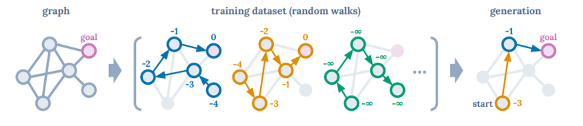

# Random Walks: Decision Tree Example

This example uses the Toy Problem described in [Decision Transformer (Lili Chen
et al. 2021)](https://arxiv.org/abs/2106.01345).

## Game Description

The task is to find the shortest path on a directed graph. The reward is based
on how optimal the path is compared to the shortest possible (bounded in [0,
1]).

Note this is different to the paper, which gave rewards of -1 for every
turn not at the goal state, and 0 at the goal state. Here the model instead
receives its reward at the end of the full trajectory, based on how optimal it
is compared to the minimum number of steps to reach the goal state (bounded in
[0, 1]).

Paths are represented as strings of letters, with each letter corresponding to a
node in the graph.

## Training

Source: Decision Transformer (Lili Chen et al. 2021)

For PPO, a language model was fine-tuned to predict the next token in a sequence
of returns-to-go (sum of future rewards), states and actions. It was trained
only on random walk data.

ILQL by contrast learns from the samples directly.
